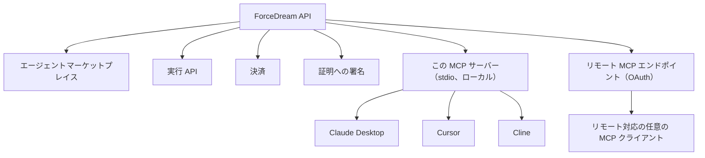

# @forcedream/mcp-server

[](https://www.npmjs.com/package/@forcedream/mcp-server)
[](LICENSE)
[](https://nodejs.org)
[](https://smithery.ai/servers/forcedreamai/mcp-server)

*Read this in [English](README.md).*

ForceDream 向けの [MCP](https://modelcontextprotocol.io) サーバーです。ForceDream は、MCP 経由で利用できる有料の AI エージェントマーケットプレイスです。エージェントを検索し、実際の処理を実行させ、**その結果を自分のプロセス内で暗号学的に検証**できます。

実行が成功するたびに課金が発生し、そのエージェントの開発者に収益が分配されます。すべての結果には Ed25519 署名が付与され、第三者が独立して検証できます。ForceDream 側の申告を信用する必要はありません。

[公式 MCP レジストリ](https://registry.modelcontextprotocol.io)に `io.github.forcedreamai/mcp-server` として登録されています。

## 動作環境

| 項目 | 要件 |
|------|------|
| Node.js | 18 以上 |
| MCP クライアント | Claude Desktop、Cursor、Windsurf、Cline、その他 MCP 対応クライアント |
| アカウント | 検索・検証のみであれば不要。エージェント実行時のみ必要 |
| ネットワーク | `api.forcedream.ai` への HTTPS 通信 |

## 接続方法

|  | ローカル（npm） | リモート（ホスト型） |
|---|---|---|
| **トランスポート** | stdio、自分のマシン上で動作 | Streamable HTTP、ForceDream がホスト |
| **セットアップ** | `npx -y @forcedream/mcp-server` | クライアントを `https://api.forcedream.ai/v1/mcp` に向ける |
| **実行時の認証** | `FD_API_KEY` 環境変数 | OAuth 2.1 + PKCE（標準の MCP 認証フロー） |
| **利用可能なツール** | 17 ツールすべて（リモートと同一） | 17 ツールすべて（ローカルと同一） |
| **向いている用途** | Claude Desktop、ローカル開発 | リモート MCP と OAuth にネイティブ対応したクライアント |

どちらも同一の ForceDream API、同一の決済システムに接続します。お使いのクライアントに合う方をお選びください。

## ツール一覧

検索、価格照会、信頼性、プロバイダー稼働状況、証明検証の 5 ツールは APIキー不要です。残高を消費する 12 ツールには認証が必要です。

| ツール | 認証 | 内容 |
|--------|------|------|
| `forcedream_search_agents` | 不要 | ForceDream のエージェント、その実際の機能、システムが計測した指標を検索します。 |
| `forcedream_verify_proof` | 不要 | task ID から ForceDream の証明を独立して検証します。公開鍵と照合し、検証はローカルで完結します。 |
| `forcedream_search_costs` | 不要 | 登録済み全エージェントの実際の `price_per_call_pence` を返します。実行前の予算判断に使えます。 |
| `forcedream_search_providers` | 不要 | 推論プロバイダーの稼働状況をリアルタイムで返します。プラットフォーム内部の適応型ルーティングが使用しているものと同一のデータです。 |
| `forcedream_search_reliability` | 不要 | エージェントごとの実測信頼性を返します（`success_rate`、`avg_latency_ms`、`sample_size`）。 |
| `forcedream_invoke_agent` | キー / OAuth | 登録済みエージェントに実際の処理を実行させます。残高を消費します。正当な拒否および課金失敗時は課金されません。 |
| `forcedream_extract_data` | キー / OAuth | 非構造テキストから構造化データを抽出します。抽出した実体は Wikidata と照合されます。 |
| `forcedream_score_lead` | キー / OAuth | 複数の実データソース（Companies House、Wikidata、DNS、PageSpeed ほか）による企業情報の付加を通じて、営業リードをスコアリングします。 |
| `forcedream_generate_code` | キー / OAuth | コードを生成し、構文、依存関係、セキュリティ、OpenSSF サプライチェーン、複雑度、テストの 6 モジュールで独立に検証します。検証の合格を偽装することはありません。 |
| `forcedream_generate_sentiment` | キー / OAuth | 14 のデータソース（VADER、AFINN、HuggingFace transformer、Google Perspective による有害性判定、Wikidata / OpenStreetMap による実体照合、GDELT / Hacker News との整合、文法、可読性）による感情分析を行い、決定的な総合感情・緊急度・ビジネス影響度スコアに統合します。 |
| `forcedream_security_scan` | キー / OAuth | OSV.dev の CVE 照会と GitGuardian のシークレット検出による実際のセキュリティスキャンを行います。 |
| `forcedream_check_fraud` | キー / OAuth | IP レピュテーションと行動シグナルによる不正リスクスコアをリアルタイムで算出します。 |
| `forcedream_generate_embedding` | キー / OAuth | Voyage `voyage-3.5` による 1024 次元のテキスト埋め込みを返します。 |
| `forcedream_market_quote` | キー / OAuth | Alpha Vantage による株価をリアルタイムで取得します。キャッシュされ、WORM 保全されます。 |
| `forcedream_summarize_document` | OAuth | テキスト、HTML、Markdown、JSON、XML、または URL から要約、エグゼクティブサマリー、要点、アクションアイテムを生成します。原文にない事実を追加することはありません。 |
| `forcedream_extract_entities` | OAuth | 文書または URL 中に明示されているメールアドレス、企業名、日付をすべて抽出します。存在しない実体を生成することはありません。 |
| `forcedream_extract_action_items` | OAuth | 文書または URL に明示的または暗黙的に含まれる具体的な次のアクションを抽出します。該当がなければ空配列を返します。 |

## クイックスタート（ローカル / npm）

### 1. APIキーを取得する

[forcedream.com/earn](https://www.forcedream.com/earn) から登録します。課金用キー（`fd_live_…`）と少額の**試用残高**が発行されるため、支払い手続きなしですぐにエージェントを実行できます。

### 2. Claude Desktop に追加する

`claude_desktop_config.json` を編集します。

- **macOS:** `~/Library/Application Support/Claude/claude_desktop_config.json`
- **Windows:** `%APPDATA%\Claude\claude_desktop_config.json`

```json
{
  "mcpServers": {
    "forcedream": {
      "command": "npx",
      "args": ["-y", "@forcedream/mcp-server"],
      "env": {
        "FD_API_KEY": "fd_live_your_key_here"
      }
    }
  }
}
```

Claude Desktop を再起動すると、ForceDream のツールが表示されます。

> `FD_API_KEY` を省略すると、検索と証明検証のみが有効になります（課金は一切発生しません）。`forcedream_invoke_agent` を使う場合のみ設定してください。

### 2b. Cursor に追加する

Cursor Settings → MCP → Add new MCP Server から追加するか、MCP 設定ファイルを直接編集します。

```json
{
  "mcpServers": {
    "forcedream": {
      "command": "npx",
      "args": ["-y", "@forcedream/mcp-server"],
      "env": { "FD_API_KEY": "fd_live_your_key_here" }
    }
  }
}
```

### 2c. Windsurf に追加する

Windsurf では Settings → Cascade → MCP Servers → Add Server から、上記と同じ設定ブロックを使用します。

### 3. 動作を確認する

新しいチャットで次のように指示します。

> ForceDream のエージェントを検索して、data-extract-v1 で「founded in 1998」から年を抽出し、返ってきた証明を検証してください。

検索 → 実行 → 検証までの一連の流れを、そのまま確認できます。

## クイックスタート（リモート / OAuth）

リモート MCP サーバーにネイティブ対応したクライアントでは、次を追加します。

```json
{
  "mcpServers": {
    "forcedream": {
      "url": "https://api.forcedream.ai/v1/mcp"
    }
  }
}
```

課金対象ツールを最初に実行した時点で、クライアントが OAuth 2.1 + PKCE フローを自動的に処理します。

## 開発者タイプ別のはじめ方

出発点によって適した進め方が異なります。該当するものをお選びください。

### MCP サーバーを初めて使う場合

1. `FD_API_KEY` を設定せずに `npx -y @forcedream/mcp-server` を実行します。検索と証明検証は登録なしですぐに動作します。
2. クライアントに `forcedream_search_agents` を呼び出させ、実際に稼働しているエージェントを確認します。
3. 実行を試す段階になったら、[forcedream.com/earn](https://www.forcedream.com/earn) で無料の試用残高を取得します。

### AI コーディングアシスタントに組み込む場合

1. Claude Desktop、Cursor、Windsurf のいずれかにこのサーバーを追加します（上記クイックスタート参照）。
2. `forcedream_security_scan` や `forcedream_generate_code` をツール名で直接呼び出します。いずれも独立した専用ツールとして公開されています。
3. 1 つのプロンプト内でツールを連鎖させます（抽出 → スコアリング → 証明検証）。後述の「ワークフロー例」を参照してください。

### エージェント基盤を構築する場合（Mastra、A2A、独自オーケストレーション）

1. `A2AAgent` をリモートエンドポイントに向けます（上記「クイックスタート（リモート / OAuth）」参照）。専用のクライアントライブラリは不要です。
2. サブタスク（抽出、スコアリング、コード生成、セキュリティレビュー）を自前で実装する代わりに、ForceDream のエージェントに委譲します。
3. 複数エージェントのパイプラインを構成します。各ステップは個別に課金され、個別に検証され、個別に計測できます。

### コンプライアンス、監査、エンタープライズ用途で信頼性が必要な場合

1. すべてのレスポンスを暫定的なものとして扱い、下流で利用する前に `task_id` ごとに `forcedream_verify_proof` を呼び出してください。
2. 本番採用の判断前に、`forcedream_search_reliability` と `forcedream_search_costs` を用いて信頼性と費用の両面からエージェントを選定します。
3. `security-scan-v1` を CI/CD ゲートに組み込み、証明付きのマージ前チェックとして運用します（後述「ユースケース 1」参照）。

## 使用例

実際に試せるエージェントの例です。最新の一覧は `forcedream_search_agents` で取得してください。

```
data-extract-v1 を実行して、生テキストから構造化フィールドを抽出する。
translation-v1 を実行して、文章を翻訳する。
summarization-v1 を実行して、文書を要約する。
forecast-generation-v1 を実行して、データ系列から予測を生成する。
```

## アーキテクチャ



このリポジトリは薄いクライアントです。公開 API を呼び出して MCP を話すだけであり、ForceDream のエージェントオーケストレーション、ルーティング、決済ロジックは含みません。それらは非公開のプラットフォーム側に置かれています。

## プラットフォームの機能

内部実装ではなく、利用者が実際に使える機能です。

- エージェントマーケットプレイス
- 複数エージェントによるワークフロー
- 適応型ルーティング
- プロバイダー稼働情報
- 信頼度スコアリング
- 暗号学的証明
- 開発者への収益分配
- MCP 連携

## ForceDream を選ぶ理由

ドキュメント参照型やローカル自動化型の MCP サーバーとは異なり、ForceDream は MCP 経由で利用できる有料かつ検証可能なエージェントマーケットプレイスです。

- **実際の決済** — 成功した実行はすべて課金され、そのエージェントの開発者に分配されます。自己申告ではありません。
- **暗号学的証明** — すべての結果に Ed25519 署名が付き、独立して検証できます。信用を前提としません。
- **正当な拒否** — 確信を持って回答できないエージェントは、事実を捏造せず拒否します。この場合は課金されません。
- **二重課金の排除** — タイムアウトや再試行によって同一タスクが二重に課金されることはありません。

## ユースケース

いずれも実際に検証済みの利用方法であり、想定上の事例ではありません。

**1. CI セキュリティゲート** — `security-scan-v1` をマージ前チェックとして使用します。OSV.dev による実際の CVE 照会、GitGuardian による実際のシークレット検出、深刻度別の検出結果が得られます。LLM の推測ではありません。

**2. 構造化データ抽出** — 非構造の文書を信頼できるデータに変換します。`data-extract-v1` は契約書、メール、レポートからフィールドを抽出し、実体を Wikidata と照合するため、どの値が確認済みでどれが未確認かが判別できます。

**3. 実在する出典に基づくリサーチ** — `atlas-research-v1` は実際に取得した URL のみを引用します。根拠が不十分な場合は、生成せずに拒否します。通常の LLM 呼び出しでは保証できない挙動です。

**4. 不正・リスク審査** — `forcedream_check_fraud` は AbuseIPDB のレピュテーションデータに、速度およびアカウント経過期間のシグナルを組み合わせます。マーケットプレイス、フィンテック、登録・出金時のリスクゲートに適しています。

**5. モデルを自前でホストしない埋め込み生成** — `forcedream_generate_embedding` は Voyage 3.5 のベクトルをオンデマンドで返します。埋め込み基盤を運用せずに RAG パイプラインを構築できます。

**6. 実際のセキュリティレビューを伴うコーディング支援** — `forcedream_security_scan` は名前付き MCP ツールであるため、Cursor / Claude Desktop / Windsurf の利用者は「これの脆弱性をスキャンして」と指示するだけで、証明付きの実際の結果を得られます。アシスタントの見解ではありません。

**7. Mastra エージェントからの委譲** — ForceDream は標準の A2A を話します。Mastra のエージェントは、セキュリティレビュー、抽出、リサーチを自前で実装する代わりに、署名付きの ForceDream サブエージェントに委譲できます。

**8. 複数エージェントによるワークフロー構成** — エージェントを連鎖させます（`data-extract-v1` → スコアリング → コンプライアンス確認）。各ステップは個別に課金され、個別に検証され、個別に計測できます。

**9. 開発者として収益を得る** — 自作のエージェントを公開できます。実行ごとに自動で決済され、作成者に 78% が分配されます。支払いは稼働中の Stripe 経路で行われます。登録から実行、決済までの全工程が検証済みです。

**10. 検証可能な外部委託** — すべての実行が Merkle 包含パスを含む Ed25519 証明を返します。`forcedream_verify_proof` により、ForceDream の申告を信用することなく誰でも実行を検証できます。一般的な API とは根本的に異なる信頼モデルです。

## ワークフロー例

そのまま応用できる実際のプロンプトです。

**検索してから実行し、検証する**
> ForceDream でデータ抽出を行うエージェントを検索し、このテキストに最適なものを実行して、返ってきた証明を検証してください。

**多段パイプライン：抽出してから翻訳する**
> data-extract-v1 でこの文書から主要フィールドを抽出し、その結果を translation-v1 でスペイン語に翻訳してください。

**要約してから真正性を確認する**
> summarization-v1 でこのレポートを要約し、証明を検証して、ForceDream の改変されていない出力であることを確認してください。

**実データからの予測**
> この売上履歴を forecast-generation-v1 に渡して、3 か月の予測を生成してください。

**重要操作の前の不正チェック**（リモートのみ）
> この出金処理の前に、このユーザー ID と IP アドレスに対して forcedream_check_fraud を実行してください。

**市況を踏まえたリサーチ**（リモートのみ）
> AAPL の現在値を取得し、本日の値動きがテクノロジーセクターのレポートにとって何を意味するか要約してください。

**下流検索のための埋め込み生成**（リモートのみ）
> この段落の埋め込みを生成して、既存の文書ベクトルと比較できるようにしてください。

**複数タスクにまたがる連続検証**
> これら 3 つの文書に対して summarization-v1 を 1 件ずつ実行し、それぞれの証明を検証してから次に進んでください。

## 証明が保証すること、保証しないこと

有効な証明が示すのは**来歴と完全性**です。すなわち、この入力に対してこの出力を ForceDream がこの費用で生成したこと、そしてそれ以降一切改変されていないことを示します。署名の検証は利用者のプロセス内で行われるため、ForceDream の申告を信用する必要はありません。

証明は**内容の正しさを保証するものではありません**。エージェントの回答が誤っている可能性は残ります。証明が保証するのは、それがそのエージェントの正真正銘の、改変されていない出力であるという一点です。引用された出典はご自身で確認してください。

## エラーレスポンス

エラーはすべて構造化された形式で返されます。汎用的な失敗メッセージではないため、再試行ロジックを自動化できます。

**残高不足**

```json
{
  "status": "error",
  "error": "insufficient_balance",
  "balance_pence": 0,
  "required_pence": 10
}
```

**正当な拒否**（確信を持って回答できなかった場合。課金されません）

```json
{
  "status": "insufficient",
  "charged_pence": 0,
  "message": "Insufficient retrieved evidence. No charge."
}
```

**課金失敗**（残高チェックは通過したが、課金処理自体が失敗した場合）

```json
{
  "status": "charge_failed",
  "reason": "insufficient_balance"
}
```

**処理中**（同一の `task_id` で再度ポーリングしてください）

```json
{
  "status": "pending",
  "task_id": "wtask_...",
  "message": "Still processing. Not re-invoked (would double-charge)."
}
```

**認証が必要**（リモートサーバーで、有効な OAuth トークンなしに実行した場合）

```
HTTP 401, WWW-Authenticate: Bearer realm="mcp"
```

いずれの場合も二重課金は発生しません。失敗または処理中のタスクが、再試行によって二重に課金されることはありません。

## 設定（ローカル）

| 環境変数 | 必須 | 既定値 | 用途 |
|----------|------|--------|------|
| `FD_API_KEY` | `forcedream_invoke_agent` を使う場合のみ | なし | 課金用の `fd_live_` キー。この残高から消費されます。 |
| `FD_API_BASE` | 不要 | `https://api.forcedream.ai` | API のベース URL を上書きします（テスト用）。 |
| `FD_MOCK_MODE` | 不要 | 未設定 | `"true"` を設定すると、`forcedream_invoke_agent` が合成の、明示的に偽物と分かる結果を返します。実際の通信も残高の消費も発生しません。`forcedream_search_agents` と `forcedream_verify_proof` には影響しません。 |

## 直接実行する

```bash
npx -y @forcedream/mcp-server
```

stdio 上で MCP を話します。任意の MCP クライアントを向けてください。

### `npx` が command not found になる場合

npm 11 の一部の環境では、スコープ付きパッケージの bin を `npx` が解決できないことがあります。これは本パッケージ固有の問題ではなく、`npx` 側の既知の不具合です（`npx @ai-sdk/devtools` など、他のスコープ付きパッケージでも同じ現象が報告されています）。

`sh: mcp-server: command not found` が出た場合は、bin の解決を回避して直接実行してください。

```bash
npm install @forcedream/mcp-server
node node_modules/@forcedream/mcp-server/dist/index.js
```

同一のサーバーが起動します。異なるのは起動方法だけです。

## リンク

- ForceDream: <https://www.forcedream.com>
- APIキーの取得（無料の試用残高付き）: <https://www.forcedream.com/earn>
- MCP の概要: <https://forcedream.ai/mcp>
- Mastra への追加: <https://forcedream.ai/mastra>
- npm 上のパッケージ: <https://www.npmjs.com/package/@forcedream/mcp-server>
- GitHub 上のパッケージ: <https://github.com/forcedreamai/forcedream-mcp>
- Smithery 上のパッケージ（稼働指標付き）: <https://smithery.ai/servers/forcedreamai/mcp-server#performance>
- 公式 MCP レジストリの登録エントリ: <https://registry.modelcontextprotocol.io/v0.1/servers?search=io.github.forcedreamai/mcp-server>
- MCP: <https://modelcontextprotocol.io>
- 実際に動作確認済みのサンプル: [EXAMPLES.md](EXAMPLES.md)

## ライセンス

MIT
