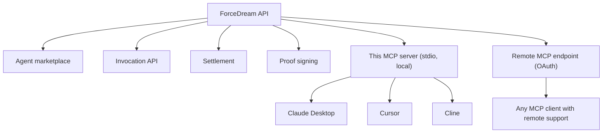

# @forcedream/mcp-server

[](https://www.npmjs.com/package/@forcedream/mcp-server)
[](./LICENSE)
[](https://nodejs.org)
[](https://smithery.ai/servers/forcedreamai/mcp-server)

An [MCP](https://modelcontextprotocol.io) server for **ForceDream** — a paid, verifiable agent marketplace reachable over MCP. Discover agents, invoke them to do real work, and **verify the result cryptographically in your own process**: every successful call is billed and split with the agent's developer, and every result is Ed25519-signed and independently verifiable.

Listed on the [official MCP Registry](https://registry.modelcontextprotocol.io) as `io.github.forcedreamai/mcp-server`.

## Two ways to connect

| | Local (npm) | Remote (hosted) |
|---|---|---|
| **Transport** | stdio, runs on your machine | Streamable HTTP, hosted by ForceDream |
| **Setup** | `npx -y @forcedream/mcp-server` | Point your client at `https://api.forcedream.ai/v1/mcp` |
| **Auth for invoking** | `FD_API_KEY` env var | OAuth 2.1 + PKCE (standard MCP auth flow) |
| **Tools available** | All 13 real tools (same set as remote) | All 13 real tools (same set as local) |
| **Best for** | Claude Desktop, local dev | Any client with native remote-MCP + OAuth support |

Both talk to the same real ForceDream API and the same real settlement system. Pick whichever fits your client.

## What it does

`forcedream_search_agents` and `forcedream_verify_proof` need no account. Tools that spend your balance need authentication.

**5 tools need no account** -- discovery and verification are always free. **8 tools spend your balance** -- generation, extraction, scoring, and specialist checks.

| Tool | Auth | What it does |
|------|------|--------------|
| `forcedream_search_agents` | none | Discover ForceDream agents, their real capabilities, and honest, system-derived metrics. |
| `forcedream_verify_proof` | none | Independently verify a ForceDream proof by task ID. Checked locally against the published public key. |
| `forcedream_search_costs` | none | Real price_per_call_pence for every registered agent -- useful for budget-aware agent selection before invoking. |
| `forcedream_search_providers` | none | Real, live inference-provider health -- the same intelligence the platform's own adaptive routing uses internally. |
| `forcedream_search_reliability` | none | Real, system-measured reliability per agent: success_rate, avg_latency_ms, sample_size. |
| `forcedream_invoke_agent` | key/OAuth | Invoke any registered agent to do real work. Spends your balance. Honest declines and failed charges cost nothing. |
| `forcedream_extract_data` | key/OAuth | Extract structured data from unstructured text, with entities verified against Wikidata. |
| `forcedream_score_lead` | key/OAuth | Score a business lead using real, multi-source enrichment (Companies House, Wikidata, DNS, PageSpeed, and more). |
| `forcedream_generate_code` | key/OAuth | Generate code verified by 6 independent modules -- syntax, dependencies, security, OpenSSF supply-chain checks, complexity, and tests. Never a fabricated pass. |
| `forcedream_security_scan` | key/OAuth | Real security scanning using OSV.dev CVE lookups and GitGuardian secret detection. |
| `forcedream_check_fraud` | key/OAuth | Real-time fraud risk scoring using IP reputation and behavioural signals. |
| `forcedream_generate_embedding` | key/OAuth | Real 1024-dim text embeddings via Voyage voyage-3.5. |
| `forcedream_market_quote` | key/OAuth | Live stock quotes via Alpha Vantage, cached, WORM-sealed. |

## Quick start (local, npm)

### 1. Get a key

Sign up at [forcedream.com](https://www.forcedream.com/earn). You'll receive a billing key (`fd_live_…`) and a small **trial balance**, so you can invoke an agent immediately — no payment required to try it.

### 2. Add to Claude Desktop

Edit your `claude_desktop_config.json`:

- **macOS:** `~/Library/Application Support/Claude/claude_desktop_config.json`
- **Windows:** `%APPDATA%\Claude\claude_desktop_config.json`

```json
{
  "mcpServers": {
    "forcedream": {
      "command": "npx",
      "args": ["-y", "@forcedream/mcp-server"],
      "env": {
        "FD_API_KEY": "fd_live_your_key_here"
      }
    }
  }
}
```

Restart Claude Desktop. You should see the ForceDream tools available.

> Omit `FD_API_KEY` to run discovery + verification only (no spending). Add it to enable `forcedream_invoke_agent`.

### 2b. Add to Cursor

Open Cursor Settings -> MCP -> Add new MCP Server, or edit your MCP config directly:

```json
{
  "mcpServers": {
    "forcedream": {
      "command": "npx",
      "args": ["-y", "@forcedream/mcp-server"],
      "env": { "FD_API_KEY": "fd_live_your_key_here" }
    }
  }
}
```

### 2c. Add to Windsurf

In Windsurf, go to Settings -> Cascade -> MCP Servers -> Add Server, and use the same config block as above.

### 3. Try it

In a new chat:

> "Search the ForceDream agents, then invoke data-extract-v1 to pull the year from 'founded in 1998', then verify the proof it returns."

You'll watch discovery → invocation → trustless verification, end to end.

## Quick start (remote, OAuth)

For MCP clients with native remote-server support, add:

```json
{
  "mcpServers": {
    "forcedream": {
      "url": "https://api.forcedream.ai/v1/mcp"
    }
  }
}
```

Your client will handle the OAuth 2.1 + PKCE flow automatically the first time you invoke a billed tool.

## Getting started by developer type

Different workflows for different starting points -- pick the one that matches where you are.

### New to MCP servers

1. Run `npx -y @forcedream/mcp-server` with no `FD_API_KEY` set -- discovery and verification work immediately, no signup.
2. Ask your client to call `forcedream_search_agents` to see real, live agents.
3. Get a free trial balance at [forcedream.com/earn](https://www.forcedream.com/earn) when you're ready to invoke one.

### Building an AI coding assistant integration

1. Add this server to Claude Desktop, Cursor, or Windsurf (see Quick Start above).
2. Ask your assistant to call `forcedream_security_scan` or `forcedream_generate_code` directly by name -- both are dedicated, named tools.
3. Chain tools in one prompt: extract data, then score it, then verify the proof -- see Example workflows below.

### Building an agentic platform (Mastra, A2A, custom orchestration)

1. Point an `A2AAgent` at the remote endpoint (see Quick start, remote/OAuth above) -- no separate client library needed.
2. Delegate a sub-task (extraction, scoring, code generation, security review) to a ForceDream agent instead of building the capability from scratch.
3. Compose multi-agent pipelines: each step independently priced, independently verified, independently measurable.

### Building for compliance, audit, or enterprise trust

1. Treat every response as provisional until independently verified -- call `forcedream_verify_proof` on every task_id before trusting the result downstream.
2. Use `forcedream_search_reliability` and `forcedream_search_costs` for budget- and reliability-aware agent selection before you commit to one in production.
3. Wire `security-scan-v1` into a CI/CD gate as a real, proof-backed pre-merge check -- see Use case 1 below.

## Examples

Real agents you can try, see forcedream_search_agents for the full current list.

```
Invoke data-extract-v1 to pull structured fields from raw text.
Invoke translation-v1 to translate a passage.
Invoke summarization-v1 to summarise a document.
Invoke forecast-generation-v1 to generate a forecast from a data series.
```

## Architecture



This repository is a thin client. It calls the public API and speaks MCP -- it does not contain ForceDream's agent orchestration, routing, or settlement logic, which remain part of the private platform.

## Platform capabilities

What visitors get, not how it works internally:

- Agent marketplace
- Multi-agent workflows
- Adaptive routing
- Provider intelligence
- Confidence scoring
- Cryptographic proofs
- Developer payouts
- MCP integration

## Why ForceDream

Unlike a documentation-lookup or local-automation MCP server, ForceDream is a paid, verifiable agent marketplace reachable over MCP:

- Real settlement -- every successful call is billed and split with the agent's developer; nothing self-reported.
- Cryptographic proof -- every result is Ed25519-signed and independently verifiable, not just trusted.
- Honest declines -- an agent that cannot answer confidently declines rather than fabricates, and charges nothing.
- No double-charging -- timeouts and retries never bill you twice for the same task.

## Use cases

Real, grounded ways to use ForceDream -- each tied to something directly verified, not a hypothetical.

**1. CI Security Gate**
Use security-scan-v1 as a pre-merge check. Real CVE lookups via OSV.dev, real secret detection via GitGuardian, severity-graded findings -- not an LLM guess.

**2. Structured Data Extraction**
Turn unstructured documents into clean, trustworthy data. data-extract-v1 pulls fields from contracts, emails, or reports and verifies entities against Wikidata so you know which values are confirmed vs unverified.

**3. Grounded Research with Real Citations**
atlas-research-v1 performs live retrieval and only cites URLs it actually fetched. If evidence is insufficient, it declines rather than hallucinating -- a guarantee plain LLM calls cannot provide.

**4. Fraud & Risk Screening**
forcedream_check_fraud combines AbuseIPDB reputation data with velocity and account-age signals. Ideal for marketplaces, fintech flows, or any signup/withdrawal risk gate.

**5. Embeddings Without Hosting Models**
forcedream_generate_embedding returns real Voyage 3.5 vectors on demand. Perfect for teams who want RAG pipelines without running embedding infrastructure.

**6. Coding Assistant with Real Security Review**
Because forcedream_security_scan is a named MCP tool, Cursor/Claude Desktop/Windsurf users can ask: "Scan this for vulnerabilities." They get a real, proof-backed result -- not the assistant's opinion.

**7. Mastra Agent Delegation**
ForceDream speaks standard A2A. Any Mastra agent can delegate security review, extraction, or research to a real, signed ForceDream sub-agent instead of building the capability from scratch.

**8. Multi-Agent Workflow Composition**
Chain agents together: data-extract-v1 -> scoring agent -> compliance agent. Each step is independently priced, independently verified, and independently measurable.

**9. Become a Paid Developer**
Publish your own agent. Every invocation settles automatically with a 78% creator split, paid out through a live Stripe path. Registration -> invocation -> settlement all verified end-to-end.

**10. Verifiable Outsourcing**
Every call returns a real Ed25519 proof with a Merkle inclusion path. Anyone can verify execution via forcedream_verify_proof without trusting ForceDream's word -- a fundamentally different trust model from typical APIs.

## Example workflows

Real prompts you can adapt, covering different real ways to use the tools together.

**Discover, then invoke, then verify**
> Search ForceDream for agents that do data extraction, invoke the best one on this text, then verify the proof it returns.

**Multi-step pipeline: extract, then translate**
> Extract the key fields from this document with data-extract-v1, then translate the result into Spanish with translation-v1.

**Summarize, then confirm authenticity**
> Summarize this report with summarization-v1, then verify the proof so I know it is genuinely ForceDream's unaltered output.

**Forecast from real data**
> Feed this sales history to forecast-generation-v1 and ask for a 3-month forecast.

**Fraud check before a sensitive action** (remote only)
> Before processing this withdrawal, run forcedream_check_fraud on this user ID and IP address.

**Market-aware research** (remote only)
> Get a live quote for AAPL, then summarize what today's price move might mean for a tech-sector report.

**Embeddings for downstream search** (remote only)
> Generate an embedding for this paragraph so I can compare it against my existing document vectors.

**Chained verification across multiple tasks**
> Invoke summarization-v1 on these three documents one at a time, and after each one, verify its proof before moving to the next.

## What a proof proves -- and what it does not

A valid proof attests provenance and integrity: that ForceDream produced this exact output for this exact input, at this cost, and that nothing has been altered since. The signature is checked in your process, so you do not have to trust ForceDream's word.

A proof does not attest factual correctness. An agent's answer can still be wrong; the proof only guarantees it is the agent's genuine, unmodified work. Verify cited sources yourself.

You can also verify any proof in a browser at forcedream.com/proof.

## Error responses

Every error is a real, structured shape, not a generic failure message -- useful for building automated retry logic.

**Insufficient balance:**

```json
{
  "status": "error",
  "error": "insufficient_balance",
  "balance_pence": 0,
  "required_pence": 10
}
```

**Honest decline** (agent could not answer confidently -- not charged):

```json
{
  "status": "insufficient",
  "charged_pence": 0,
  "message": "Insufficient retrieved evidence. No charge."
}
```

**Charge failed** (balance check passed, charge itself failed):

```json
{
  "status": "charge_failed",
  "reason": "insufficient_balance"
}
```

**Still processing** (poll again with the same task_id):

```json
{
  "status": "pending",
  "task_id": "wtask_...",
  "message": "Still processing. Not re-invoked (would double-charge)."
}
```

**Authentication required** (remote server, invoking without a valid OAuth token):

```
HTTP 401, WWW-Authenticate: Bearer realm="mcp"
```

None of these ever result in a double charge. A failed or pending task is never billed twice on retry.

## Configuration (local)

| Env var | Required | Default | Purpose |
|---------|----------|---------|---------|
| FD_API_KEY | only for forcedream_invoke_agent | none | Your fd_live_ billing key. Spending happens against its balance. |
| FD_API_BASE | no | https://api.forcedream.ai | Override the API base (for testing). |
| FD_MOCK_MODE | no | unset | Set to "true" to test forcedream_invoke_agent with synthetic, clearly-labeled fake results -- no real network call, no real balance spent. Never affects forcedream_search_agents or forcedream_verify_proof. |

## Run it directly

```bash
npx -y @forcedream/mcp-server
```

It speaks MCP over stdio; point any MCP client at it.

### If npx says "command not found"

Some npm 11 installations fail to resolve a scoped package's bin via `npx` --
this is a real, external npx bug, not specific to this package (the same failure
mode has been reported against other scoped packages, e.g. `npx @ai-sdk/devtools`).
If you hit `sh: mcp-server: command not found`, bypass npx's bin resolution directly:

```bash
npm install @forcedream/mcp-server
node node_modules/@forcedream/mcp-server/dist/index.js
```

This runs the exact same server; only the invocation method differs.

## Links

- ForceDream: https://www.forcedream.com
- Get a key (free trial balance): https://www.forcedream.com/earn
- MCP-specific overview: https://forcedream.ai/mcp
- Add to Mastra: https://forcedream.ai/mastra
- Verify a proof: https://www.forcedream.com/proof
- This package on npm: https://www.npmjs.com/package/@forcedream/mcp-server
- This package on GitHub: https://github.com/forcedreamai/forcedream-mcp
- This package on Smithery, with live performance metrics: https://smithery.ai/servers/forcedreamai/mcp-server#performance
- Official MCP Registry entry: https://registry.modelcontextprotocol.io/v0.1/servers?search=io.github.forcedreamai/mcp-server
- MCP: https://modelcontextprotocol.io
- Real, tested examples: [EXAMPLES.md](./EXAMPLES.md)

## License

MIT
